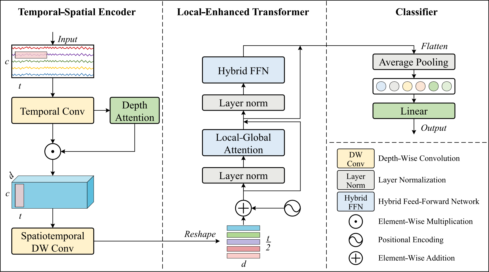

# LGFormer

Official PyTorch implementation of **[LGFormer: Integrating Local and Global Representations for EEG Decoding](https://iopscience.iop.org/article/10.1088/1741-2552/adc5a3)**, published in Journal of Neural Engineering (JNE), DOI: 10.1088/1741-2552/adc5a3.

## Introduction

LGFormer is a general-purpose convolutional neural network (CNN) - transformer model for Electroencephalography (EEG) decoding. The architecture consists of:
- Temporal-Spatial Encoder (TSE)
- Local-Enhanced Transformer (LET)
- Classifier



LGFormer integrates both local and global representations while incorporating a lightweight design, enabling efficient training and decoding on EEG data.

## Quick Start

### Input Format
To quickly use LGFormer, your input data should have the shape **(B, 1, channels, sequence_length)**, where:
- **B**: Batch size
- **channels**: Number of EEG electrode channels
- **sequence_length**: Number of temporal sample points

### Implementation
**To use LGFormer, you only need to specify three parameters**:
- **`in_channel`**: Number of EEG channels
- **`seq_len`**:  Number of temporal sample points
- **`num_classes`**: Number of classes
- 
For example:

```python
from LGFormer import LGFormer

# Initialize the model
model = LGFormer(in_channel=22, seq_len=1000, num_classes=4)

# Forward pass
output = model(input_data)  # input_data shape: [B, 1, channel, sequence_length]
```

### Example Configurations
Configurations used in the paper:

| Dataset | Channels | Sequence Length | Classes | Code |
|---------|----------|----------------|---------|------|
| BCI42A | 22 | 1000 (4s @ 250Hz) | 4 | `LGFormer(in_channel=22, seq_len=1000, num_classes=4)` |
| BCI42B | 3 | 1000 | 2 | `LGFormer(in_channel=3, seq_len=1000, num_classes=2)` |
| Cognitive workload | 28 | 400 | 3 | `LGFormer(in_channel=28, seq_len=400, num_classes=3)` |
| ERN | 56 | 280 | 2 | `LGFormer(in_channel=56, seq_len=280, num_classes=2)` |

The implementation includes default hyperparameters in the paper, and we alse provide interfaces that can be quickly adjusted for your specific task requirements.

## Citation
If you find our paper/code useful, please consider citing our work:
```bibtex
@article{yang2025lgformer,
  title={LGFormer: Integrating local and global representations for EEG decoding},
  author={Yang, Wenjie and Wang, Xingfu and Qi, Wenxia and Wang, Wei},
  journal={Journal of Neural Engineering},
  year={2025}
}
```
